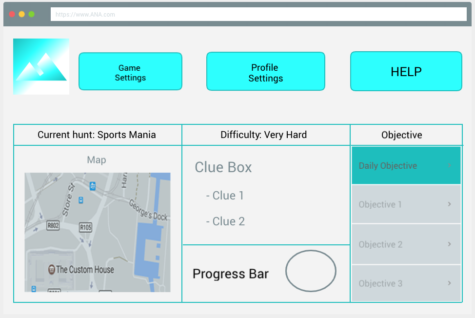
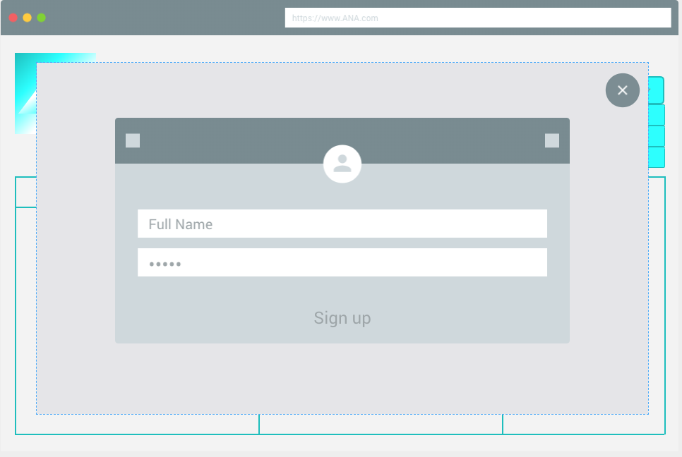
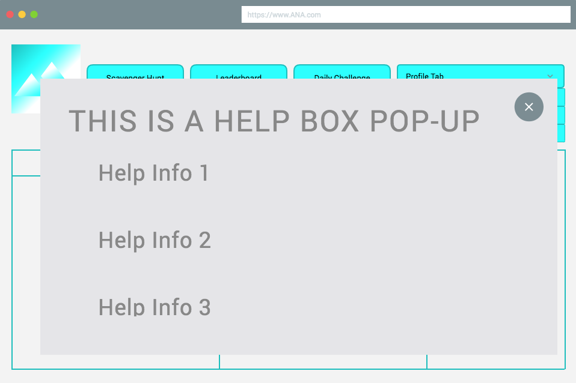
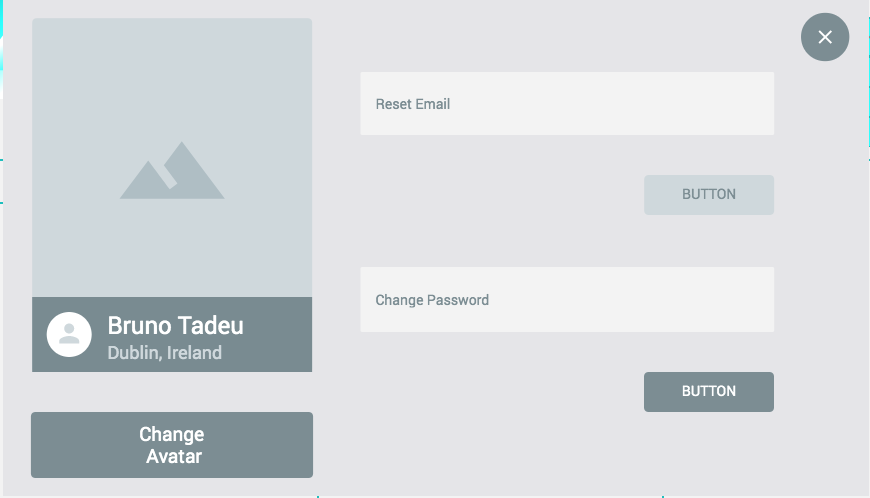
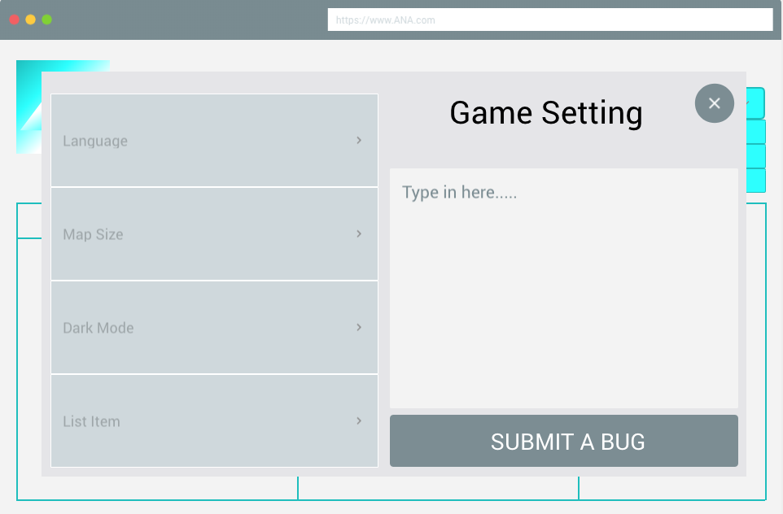

# CMSC-491
Final project for CMSC 491 - User Interface Design
# Installation
Download Node.js and npm.
To run the server:
```bash
npm start
```
Navigate to your localhost with the port number it provides you to view.


# Mockup (Jan 30, 2020)
Main Game

Login

Help

Profile Settings

Game Settings

