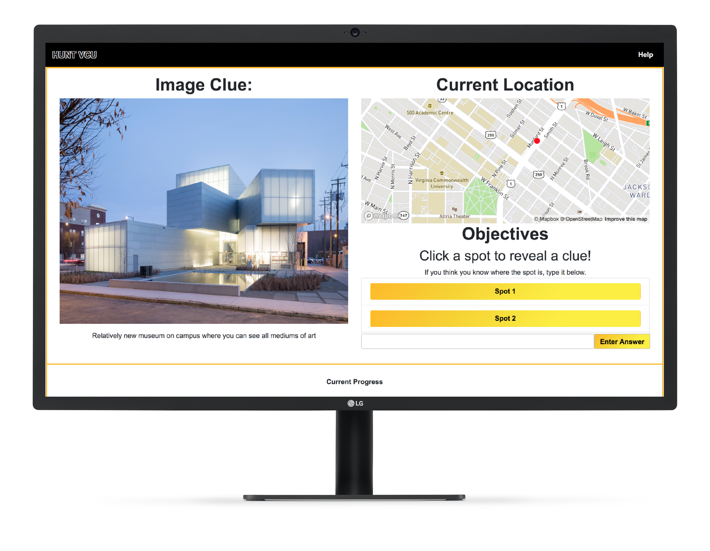

# huntVCU
During Spring 2020, coronavirus impacted the globe rapidly. Many companies and schools began telecommunicating as it was the best option to continue under quarantine. Virginia Commonwealth University faced challenges as the university closed down campus during peak college touring times. As the university worried about losing prospective students, 3 students provided a solution. 

huntVCU is a responsive single-page web application that simulates a scavenger hunt with landmarks and hotspots across campus so that a prospective or incoming student could learn the campus. The application provides text and pictures as clues to help the user figure out the location. There is also a map on the side for the user with a general radius to help the user futher identify the spot or for the user to explore. This application was developed by Noah Weingand, Alex Trainham, and Anthony Claure as a final project for VCU's CMSC-491 Spring 2020 class.



# Installation
Download Node.js and npm.
To setup and then run the server:
```bash
npm install
npm start
```

Navigate to your localhost with the port number it provides you to view.

# Mockup (Jan 30, 2020)
Main Game

Login

Help

Profile Settings

Game Settings

